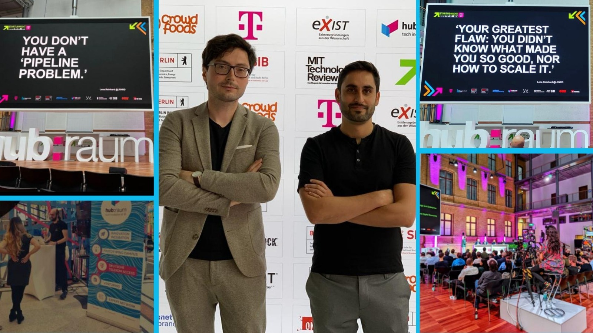

Today I was a guest at [Startupnight](https://www.startupnight.net/) in Berlin, accompanied by [Husna Korani](https://www.linkedin.com/in/husnakorani/) and [Erfan Nazmehr](https://www.linkedin.com/in/erfan-nazmehr/)(here in the picture on the right), the founders of [Spotliked](https://spotliked.de/).

Husna and Erfan, a great and strong team, shared with me some insights into the workings of their startup. As part of the [SIBB Deep Tech Accelerator](https://www.sibb.de/scholarship), they introduced it to me.

The Startupnight turned out to be a great event for me to meet investors, but especially emerging startups.

I was especially interested in potential future partners like [Cito](https://www.cito.ai/) and [driveMybox](https://en.drivemybox.de/). In any case, it was a pleasure to hear about their ideas.

I'm already looking forward to next year, when UfoCourier will be in the spotlight 🚀
