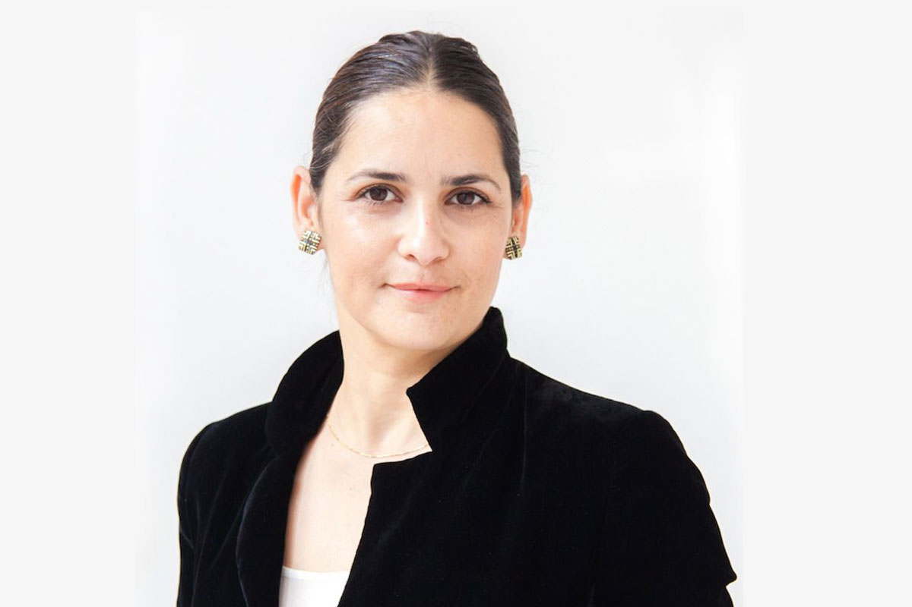

We are glad to meet our mentor - [Mali M. Baum](https://www.linkedin.com/in/mali-m-baum-0353b027/).

Mali is a serial entrepreneur, investor, mentor and community leader, Podcaster Mali Talkshow.

She is a key person in shaping Female Founders Future and opportunities at the Startups Ecosystem in Berlin/Germany and Europe founded one of the biggest and the most significant network and community, [WLOUNGE](https://www.linkedin.com/company/w-lounge-berlin/) for startups, VCs, and corporates supporting Female founders and diverse teams. Mali is an active expert and Jury at the [European Commission](https://www.linkedin.com/company/european-commission/) EIC, and connecting the tech ecosystem together for economic growth and success stories.

It's a pleasure for us to have a mentor like Mali. We are confident that under her leadership, our UfoCourier startup will quickly gain momentum and with her advice and guidance we will be able to bring our idea to life.
