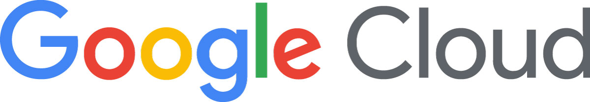

UfoCourier is the go-to platform for people who want to stay in touch with their friends and loved ones by sending packages and goods, even if they live in faraway or hard-to-reach places.

As UfoCourier, we are taking on the challenge of addressing the cross-border issues involved.

Today, we have a great partner on our side: **Google has accepted us into the [Google for Startups Cloud Program](https://cloud.google.com/startup).** This enables us to provide our services worldwide, scalable, secure and highly available.

By using Google's location-based services, we are now able to determine your shipping and delivery locations even more accurately and reliably, no matter how small, remote or otherwise difficult to locate.

By providing computing power, the Google Cloud enables us to apply strong algorithms to our real-time space-time scheduling, so that the carriers on our platform always take a near-optimal route and accept only those jobs that make economic sense for them.

Last but not least, by providing a secure and highly available infrastructure, the Google Cloud allows our users, whether broadcasters or carriers, to always have the best user experience.

Where other services let you down, UfoCourier, now powered by the Google Cloud, is always there for you.

We as UfoCourier are looking forward to welcome you on our platform soon.
